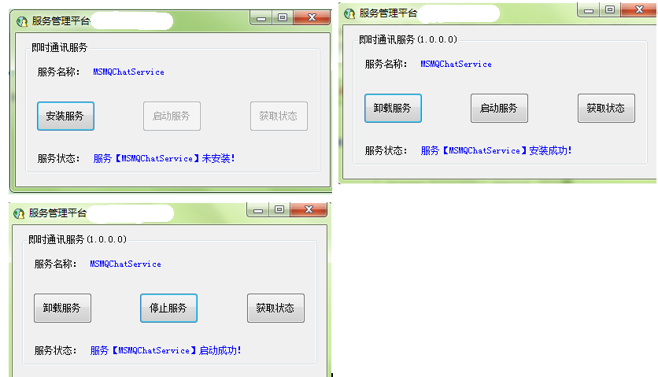

# 可视化操作的windows服务

使用C#开发自定义windows服务是一件十分简单的事。那么什么时候，我们需要自己开发windows服务呢，就是当我们需要计算机定期或者一 直执行我们开发的某些程序的时候。我经常看到许多人开发的windows服务安装卸载都是使用cmd命令来进行的，我觉得这样的话，部署起来比较麻烦，于是就考虑做了一个可视化的windows控制程序，方便，快捷。

### 参考案例：
#### 1. [界面化的windows服务安装、启动、删除](https://www.52pojie.cn/thread-564041-1-1.html)
#### 2. [C#开发可以可视化操作的windows服务](https://www.cnblogs.com/jiekzou/p/4393886.html)

##### 注意：记得将服务程序的dll拷贝到可视化安装程序的bin目录下面。包括配置文件。如果运行报错，尝试以管理员身份运行安装程序。